# ClusterDocs
Cluster documents with similar semantic description.

## The Data
300 text files of various formats (ANSI, utf-8, utf-16..) containing english words and special characters. The data is in form of emails with fields including sender, path, subject, date, body etc.

## The Cleaning
- Converted all the files to simple python strings while reading.
- Removed all the stop words, symbols, converted the string to lowercase. 
- Put the sender, receiver and body of the documents into a dataframe for easy manipulation.

## Visualising the data
It is always a good idea to get an insight into the data that we will be working on.
Here I have displayed the most common terms in the corpus after cleaning.

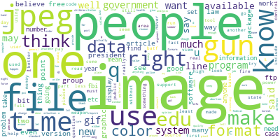

As we can see words like 'people', 'image', 'jpeg', 'file' are the most common terms.
To further quatify we can represent the terms against their frequency.

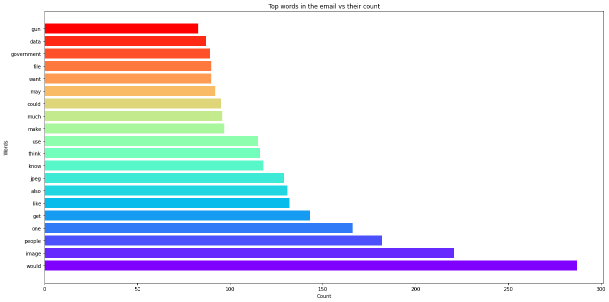

This plot is just to show the spread of the data initally to get a better understanding of what we should be expecting post clustering.

## Text to Vectors
In order to study the text data we must convert it into numerical(vector) form so that it becomes quantifiable. 
For us finding the frequency of terms and their similarity is useful since we wish to cluster them together.
This is the reason we use tf-idf (term frequency-inverse document frequency) as it refelects the importance of text in the corpus.

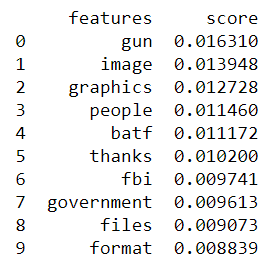
These are the top 10 terms with highest mean tf-idf.

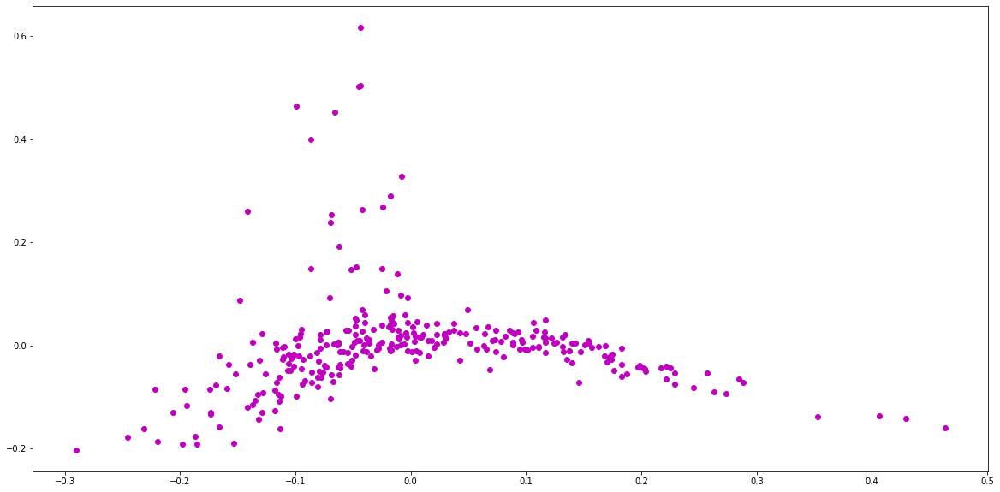

## Clustering 
There are many ways to cluster data but the simplest and most efficient is k-means. Every point is assigned to one of the 'n' clusters depending on it's distance from the mean of these clusters, the closer the better.

The only drawback of k-means is that the optimal number of clusters has to determined by bruteforce.
Here I initially used the WCSS (within-cluster-sum of-squares) which as the name suggest computes the variability of observation in each cluster.

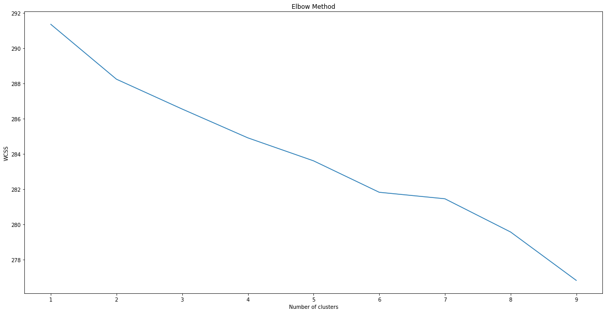
As you can see, we get a straight line which keeps decreasing even as we go to 10 clusters, this could occur due to a number of reasons including small sample size. So wcss is not a good measure for our model.

Another way is to visualise the data points in the cluster and try to see the correctness of the model ourselves.
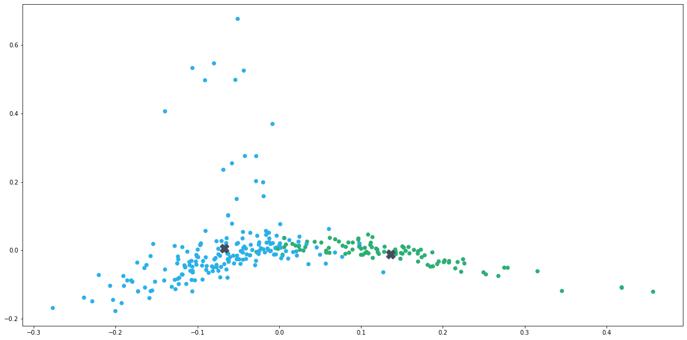

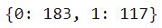

The key terms in the cluster are:
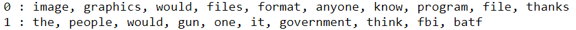

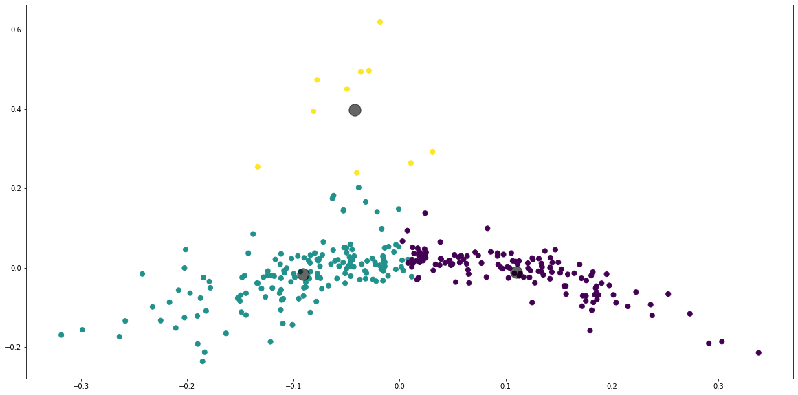

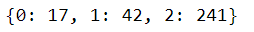

The key terms in the cluster are:

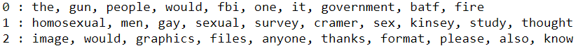

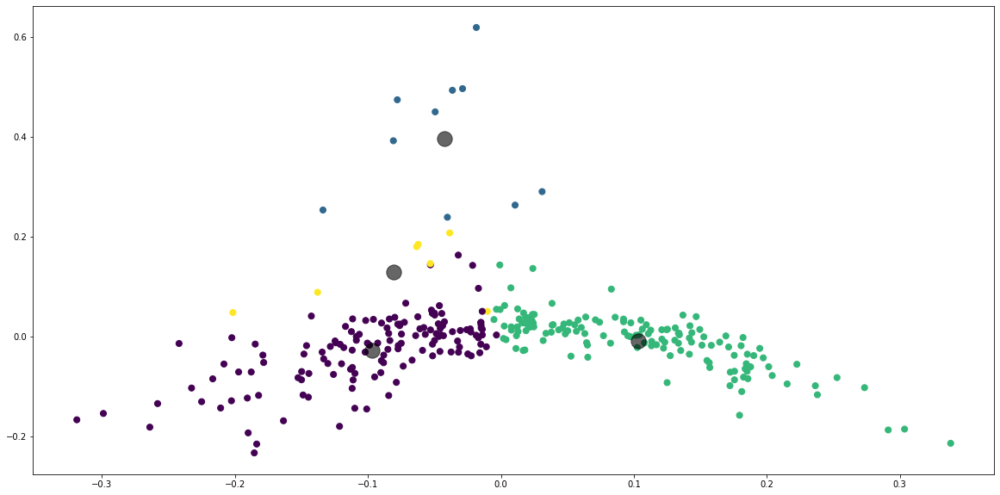

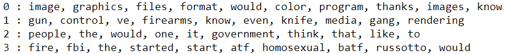

As we go higher in cluster size it becomes harder to differentiate between clusters and the key terms do not exhibit cohesion.

# The Outcome


## The Dependencies
```
pip install -r requirements.txt
```
